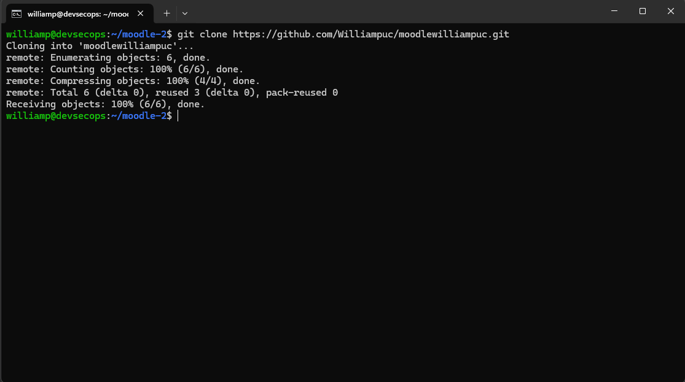
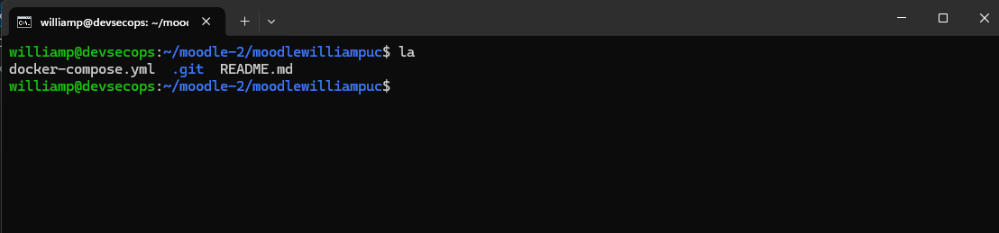
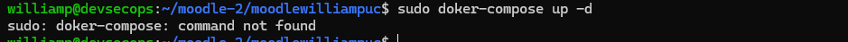
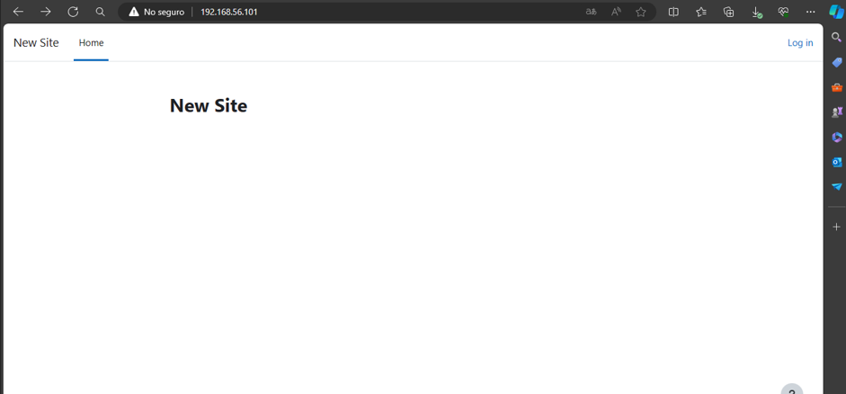
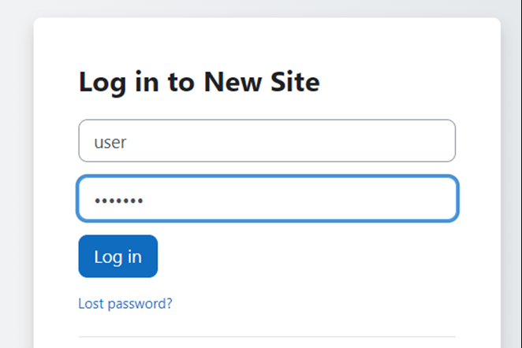
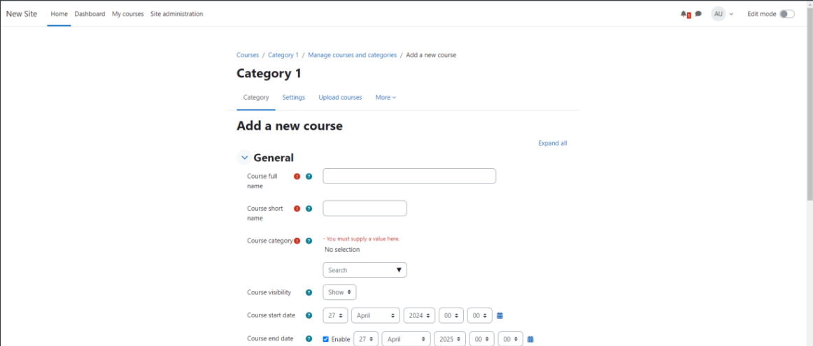
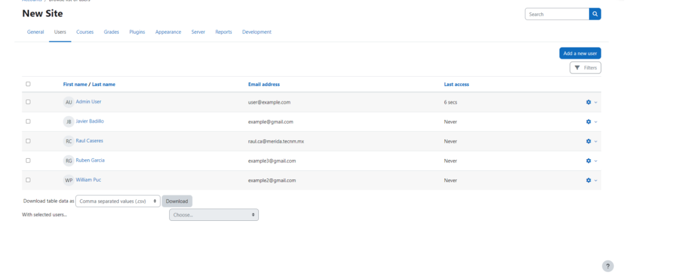
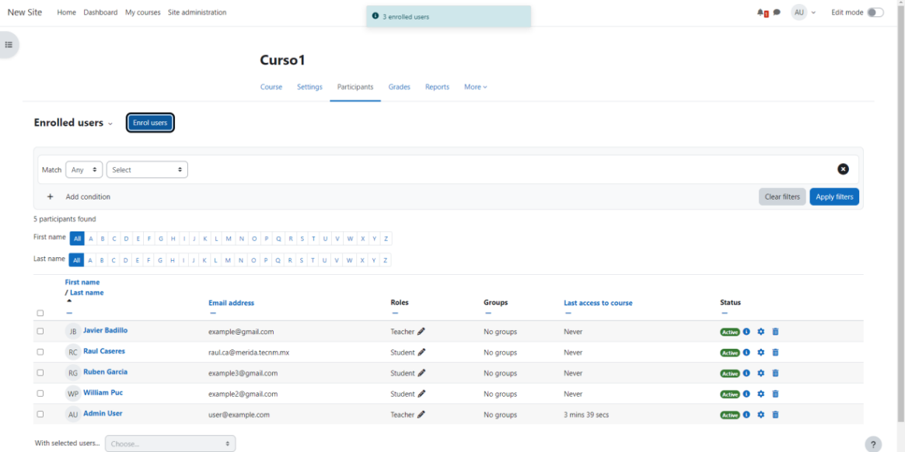
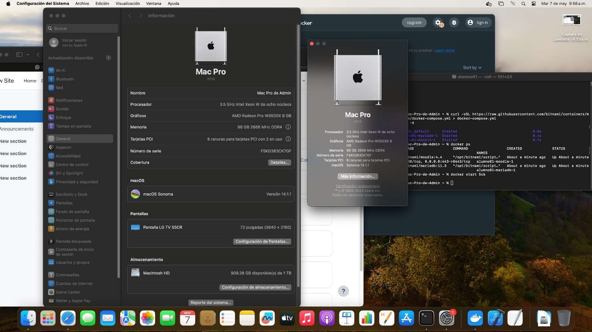

# moodlewilliampuc

lo primero que se tiene que realizar es bajar de github a local git clone https://github.com/Williampuc/moodlewilliampuc.git
  

con el comando cd se puede ver que se creo una carpeta con el nombre 
  

con el comando sudo doker-compose up -d se iniciara el moodle
  

ahora se comprueba con la ip si se levanto el moodle 
  

ahora ingresamos en moodle y iniciamos sesion can el usuario y la contraseña que son por default usuario:user contraseña:bitnami
  

creamos un curso el cual se llamara curso 1
  

luego agregamos a los participantes de ese curso
  

por ultimo agregamos a los participantes del curso
  

# Examen realizado en una Mac OS

¿Qué modelo de Mac? 
el modelo es una MAC PRO DEL 2019
 
¿Cuánta memoria RAM tiene?
 cuenta con 96 GB de RAM
 
¿Qué procesador tiene?
es un intel xeon W de ocho nucleos a 3.5 GHz
 
¿Cuántos núcleos tiene? 
cuenta con 8 nucleos
 
¿Cuántos hilos de ejecución tiene?
16 hilos
 
 ¿Qué tarjeta(s) de video tiene?
 tiene un AMD Radeon Pro W5500X
   
  

!ss

 # Examen realizado en MAC

